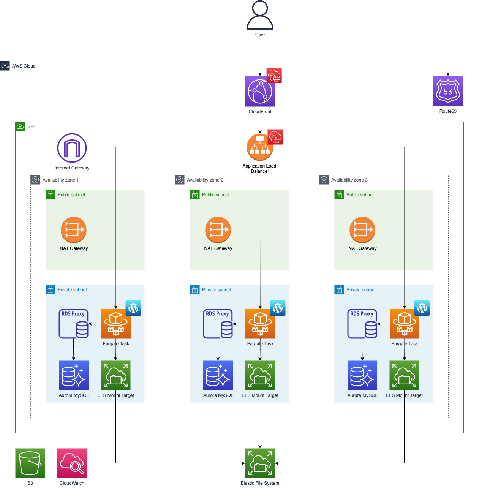

# IRCC WordPress Infrastructure

Host the IRCC WordPress site in an Amazon Elastic Container Service (ECS) Fargate cluster with the following architecture:



1. Virtual Private Cloud (VPC) with three public and three private subnets.
1. Internet Gateway (IGW) to allow inbound/outbound communication.
1. NAT Gateways (3) to allow private subnets to communicate with IGW.
1. CloudFront distribution, protected by Web Application Firewall (WAF), as main user request entry point.  CloudFront has an Application Load Balancer (ALB) as its origin.
1. ALB deployed in three public subnets and has an Elastic Container Service (ECS) Fargate cluster as its target.
1. ECS has a WordPress service with a task in each private subnet (3 total).
1. Relational Database Service (RDS) MySQL Cluster with instance in each private subnet serves as datbase for the WordPress ECS tasks.  
1. ECS WordPress tasks communicate with database through an RDS Proxy (performs connection pooling and management).
1. ECS WordPress tasks have an Elastic File System (EFS) mounted for shared file access (optional).

## Build

After starting the [VS Code devcontainer](https://code.visualstudio.com/docs/remote/containers):
```sh
# Export AWS credentials
cd terragrunt/env/prod
terragrunt run-all plan
terragrunt run-all apply
```

## Environment variables

The following Terraform variables are required:
* `cloudfront_custom_header_name`: Header name added by CloudFront. Prevents direct requests to ALB.
* `cloudfront_custom_header_value`: Header value added by CloudFront.  Prevents direct requests to ALB.
* `database_name`: Name of the database to create in the RDS cluster
* `database_username`: Root database user
* `database_password`: Root database user's password
* `list_manager_api_key`: API key used for Platform ListManager request auth
* `list_manager_endpoint`: Platform ListManager API endpoint
* `notify_api_key`: API key used for Notify request auth

WordPress [generated secret keys](https://api.wordpress.org/secret-key/1.1/salt/):
* `wordpress_auth_key`
* `wordpress_secure_auth_key`
* `wordpress_logged_in_key`
* `wordpress_nonce_key`
* `wordpress_auth_salt`
* `wordpress_secure_auth_salt`
* `wordpress_logged_in_salt`
* `wordpress_nonce_salt`